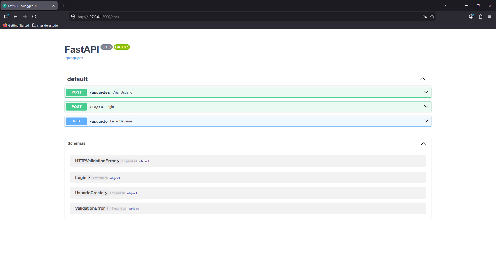
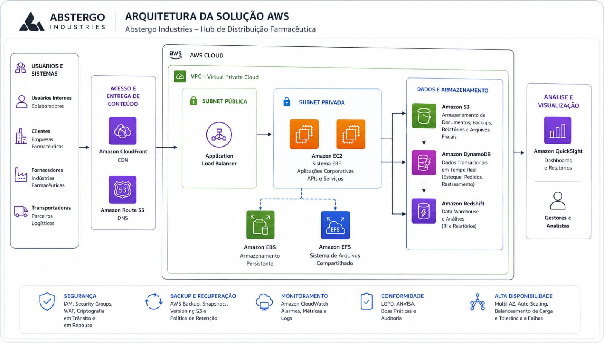

<!-- BANNER ANIMADO -->

  

<!-- DIGITAÇÃO ANIMADA -->

  

---

# 👨‍💻 Sobre mim

<!-- INTRO -->

🚛 Trabalho no setor de logística na **GDBR Toyoda Gosei**  
🎓 Estudante de **Análise e Desenvolvimento de Sistemas** na Fatec Itapetininga  
🤖 Estudando **Engenharia de Dados**, **IA** e desenvolvimento de aplicações inteligentes  
📚 Evoluindo diariamente em programação, automação e tecnologia  
⚡ Objetivo: construir projetos modernos com foco em dados e inteligência artificial

 

---

<!-- GIF CYBERPUNK -->

<!-- SEGUIDORES E ESTRELAS -->

    
    

---
<!-- TECNOLOGIAS -->

# ⚡ Tecnologias

  

---
<!-- PROJETOS -->

# 🚀 Projetos em Destaque

## 🔑 API REST com JWT Authentication — FastAPI

Projeto backend desenvolvido utilizando Python e FastAPI com autenticação JWT, criptografia de senhas e estruturação de API REST moderna.
 

---

## 🎮 Xbox Gamepass Dashboard

Este projeto consiste em um Dashboard de Business Intelligence desenvolvido no Excel, com foco na análise de dados de assinaturas do Xbox Game Pass.
 

---

## ☁ RELATÓRIO DE IMPLEMENTAÇÃO DE SERVIÇOS AWS

Este relatório apresenta a proposta de implementação de serviços AWS na empresa Abstergo Industries (fictícia), uma empresa farmacêutica especializada na distribuição de medicamentos e insumos para outras empresas do setor farmacêutico.
 

---

# 📈 Gráfico de Contribuições

---

# 🌐 Redes Sociais

  

  

  

  

---

# 🐍 Snake Animation

---

# 👀 Contador de Visitas

  

---

<!-- FOOTER -->

  

